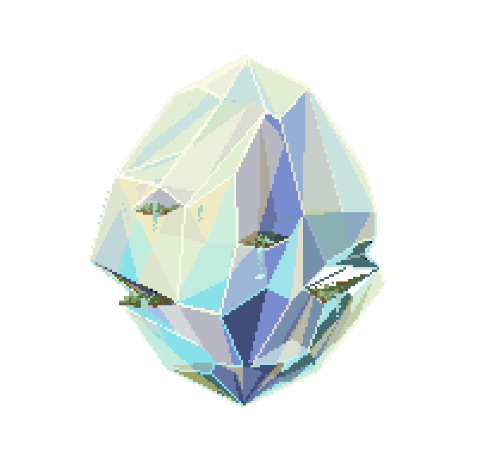

# Prismaristic 

<!-- PROJECT LOGO -->
 

    
  </a>

  <h3 align="center">Prismaristic</h3>
  

    A gamification System to help organize your life!
     
    <a href="https://github.com/M4rvita/Prismaristic/tree/main"><strong>Explore the docs »</strong></a>
     
     
    <a href="https://github.com/M4rvita/Prismaristic/tree/main">View Demo</a>
    ·
    <a href="https://github.com/M4rvita/Prismaristic/tree/issues">Report Bug</a>
    ·
    <a href="https://github.com/M4rvita/Prismaristic/tree/issues">Request Feature</a>
  

<!-- TABLE OF CONTENTS -->

  
Table of Contents

  <ol>
    <li>
      <a href="#about-the-project">About The Project</a>
      <ul>
        <li><a href="#built-with">Built With</a></li>
      </ul>
    </li>
    <li>
      <a href="#getting-started">Getting Started</a>
      <ul>
        <li><a href="#prerequisites">Prerequisites</a></li>
        <li><a href="#installation">Installation</a></li>
      </ul>
    </li>
    <li><a href="#usage">Usage</a></li>
    <li><a href="#roadmap">Roadmap</a></li>
    <li><a href="#contributing">Contributing</a></li>
    <li><a href="#license">License</a></li>
    <li><a href="#contact">Contact</a></li>
    <li><a href="#acknowledgments">Acknowledgments</a></li>
  </ol>

<!-- ABOUT THE PROJECT -->
## About The Project

(<a href="#readme-top">back to top</a>)

### Built With

(<a href="#readme-top">back to top</a>)

<!-- MARKDOWN LINKS & IMAGES -->
[issues-shield]: https://img.shields.io/github/issues/othneildrew/Best-README-Template.svg?style=for-the-badge
[issues-url]: https://github.com/M4rvita/Prismaristic/issues
